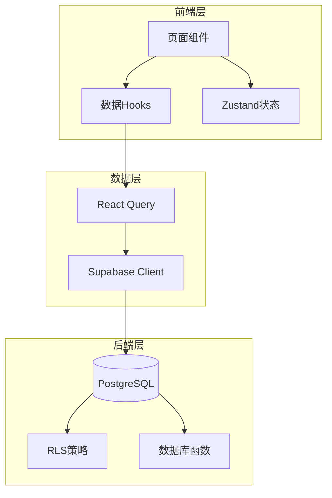
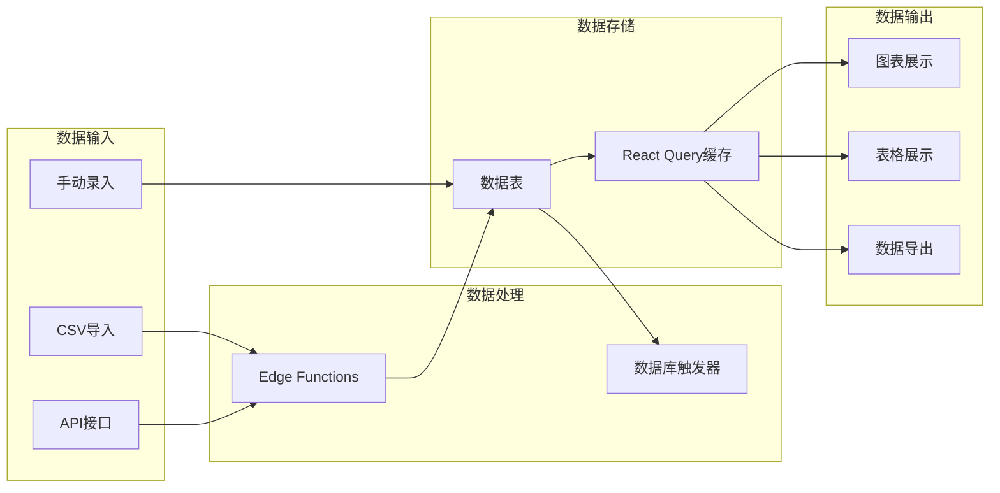

# 电力交易系统数据结构说明文档

> 版本: 1.0.0 | 更新日期: 2025-12-15 | 作者: 系统自动生成

## 目录

1. [概述](#1-概述)
2. [数据库表结构总览](#2-数据库表结构总览)
3. [业务模块数据表详情](#3-业务模块数据表详情)
4. [数据流程架构](#4-数据流程架构)
5. [RLS安全策略](#5-rls安全策略)
6. [枚举类型定义](#6-枚举类型定义)

---

## 1. 概述

### 1.1 系统架构

电力交易决策平台采用前后端分离架构：
- **前端**: React + TypeScript + Tailwind CSS
- **后端**: Supabase (PostgreSQL + Edge Functions)
- **状态管理**: Zustand + React Query

### 1.2 数据库统计

| 类别 | 数量 | 说明 |
|------|------|------|
| 数据表总数 | 46 | 包含所有业务表和系统表 |
| 外键关系 | 23 | 表间关联关系 |
| RLS策略 | 92+ | 行级安全策略 |
| 数据库函数 | 4 | 辅助函数 |

### 1.3 数据量统计 (截至2025-12-15)

| 表名 | 记录数 | 说明 |
|------|--------|------|
| market_clearing_prices | 17,160+ | 市场出清价格(山东省) |
| clearing_records | 6,696 | 出清记录 |
| load_predictions | 4,149 | 负荷预测数据 |
| price_predictions | 3,240 | 价格预测数据 |
| time_segment_clearing | 2,976 | 分时段出清数据 |
| weather_data | 700 | 气象数据 |
| energy_usage | 390 | 用电数据 |
| execution_records | 390 | 执行记录 |
| settlement_records | 252 | 结算记录 |
| power_plans | 117 | 发电计划 |
| medium_long_term_prices | 48 | 中长期价格 |
| contracts | 21 | 合同数据 |
| customers | 13 | 客户数据 |
| news_policies | 17 | 新闻政策 |
| trading_strategies | 3+ | 交易策略 |

---

## 2. 数据库表结构总览

### 2.1 按业务模块分类

```
电力交易系统数据库
├── 场站管理模块 (2表)
│   ├── power_stations      # 电站信息
│   └── trading_units       # 交易单元
├── 合同管理模块 (2表)
│   ├── contracts           # 合同主表
│   └── contract_time_series # 合同时序数据
├── 交易管理模块 (4表)
│   ├── trading_calendar    # 交易日历
│   ├── trading_bids        # 交易报价
│   ├── clearing_records    # 出清记录
│   └── time_segment_clearing # 分时段出清
├── 结算管理模块 (2表)
│   ├── settlement_records  # 结算记录
│   └── settlement_statements # 结算单据
├── 客户管理模块 (4表)
│   ├── customers           # 客户信息
│   ├── energy_usage        # 用电数据
│   ├── execution_records   # 执行记录
│   └── package_simulations # 套餐模拟
├── 策略管理模块 (3表)
│   ├── trading_strategies  # 交易策略
│   ├── backtest_results    # 回测结果
│   └── strategy_recommendations # 策略推荐
├── 预测数据模块 (6表)
│   ├── load_predictions    # 负荷预测
│   ├── price_predictions   # 价格预测
│   ├── load_forecast       # 负荷预报
│   ├── renewable_output_forecast # 新能源出力预测
│   ├── tie_line_forecast   # 联络线预测
│   └── thermal_bidding_forecast # 火电竞价预测
├── 市场数据模块 (16表)
│   ├── market_clearing_prices # 市场出清价格
│   ├── medium_long_term_prices # 中长期价格
│   ├── price_distribution  # 价格分布
│   ├── bidding_behavior_analysis # 竞价行为分析
│   ├── weather_data        # 气象数据
│   ├── weather_alerts      # 气象预警
│   ├── news_policies       # 新闻政策
│   ├── energy_crude_quotes # 原油报价
│   ├── energy_refined_quotes # 成品油报价
│   ├── energy_crack_spreads # 裂解价差
│   ├── energy_inventory    # 能源库存
│   ├── energy_related_stocks # 能源股票
│   ├── energy_news         # 能源新闻
│   ├── energy_market_indices # 市场指数
│   └── energy_ine_intraday # INE日内价格
└── 系统管理模块 (6表)
    ├── profiles            # 用户资料
    ├── user_roles          # 用户角色
    ├── permissions         # 权限配置
    ├── user_business_scope # 业务范围
    ├── report_templates    # 报表模板
    └── analysis_reports    # 分析报告
```

### 2.2 表关系概览

```
power_stations (1) ──┬──< trading_units (N)
                     │
trading_units (1) ───┼──< contracts (N)
                     ├──< power_plans (N)
                     ├──< trading_bids (N)
                     ├──< clearing_records (N)
                     ├──< time_segment_clearing (N)
                     ├──< settlement_records (N)
                     ├──< settlement_statements (N)
                     ├──< load_predictions (N)
                     ├──< strategy_recommendations (N)
                     └──< analysis_reports (N)

contracts (1) ───────< contract_time_series (N)

trading_calendar (1) ─< trading_bids (N)

trading_bids (1) ────< clearing_records (N)

trading_strategies (1) ─┬─< backtest_results (N)
                        └─< strategy_recommendations (N)

customers (1) ──────┬──< energy_usage (N)
                    ├──< execution_records (N)
                    └──< package_simulations (N)

power_plans (1) ────< power_plan_time_series (N)
```

---

## 3. 业务模块数据表详情

### 3.1 场站管理模块

#### power_stations (电站信息表)

| 字段名 | 类型 | 可空 | 默认值 | 说明 |
|--------|------|------|--------|------|
| id | uuid | NO | gen_random_uuid() | 主键 |
| name | text | NO | - | 电站名称 |
| province | text | NO | '山东' | 所属省份 |
| region | text | YES | - | 所属区域 |
| station_type | text | NO | - | 电站类型(wind/solar/hydro) |
| installed_capacity | numeric | NO | - | 装机容量(MW) |
| grid_connection_voltage | text | YES | - | 并网电压等级 |
| commission_date | date | YES | - | 投产日期 |
| location_lat | numeric | YES | - | 纬度 |
| location_lng | numeric | YES | - | 经度 |
| contact_person | text | YES | - | 联系人 |
| contact_phone | text | YES | - | 联系电话 |
| is_active | boolean | NO | true | 是否启用 |
| created_at | timestamptz | NO | now() | 创建时间 |
| updated_at | timestamptz | NO | now() | 更新时间 |

#### trading_units (交易单元表)

| 字段名 | 类型 | 可空 | 默认值 | 说明 |
|--------|------|------|--------|------|
| id | uuid | NO | gen_random_uuid() | 主键 |
| station_id | uuid | YES | - | 关联电站ID |
| unit_code | text | NO | - | 交易单元编码 |
| unit_name | text | NO | - | 交易单元名称 |
| trading_center | text | NO | - | 所属交易中心 |
| trading_category | text | NO | - | 交易类别(renewable/retail) |
| registered_capacity | numeric | YES | - | 注册容量(MW) |
| is_active | boolean | NO | true | 是否启用 |
| created_at | timestamptz | NO | now() | 创建时间 |
| updated_at | timestamptz | NO | now() | 更新时间 |

**外键关系**: station_id → power_stations(id)

---

### 3.2 合同管理模块

#### contracts (合同主表)

| 字段名 | 类型 | 可空 | 默认值 | 说明 |
|--------|------|------|--------|------|
| id | uuid | NO | gen_random_uuid() | 主键 |
| trading_unit_id | uuid | YES | - | 交易单元ID |
| contract_no | text | NO | - | 合同编号 |
| contract_name | text | NO | - | 合同名称 |
| contract_type | text | NO | - | 合同类型 |
| direction | text | NO | - | 交易方向(buy/sell) |
| counterparty | text | YES | - | 交易对手方 |
| start_date | date | NO | - | 开始日期 |
| end_date | date | NO | - | 结束日期 |
| total_volume | numeric | YES | - | 总电量(MWh) |
| unit_price | numeric | YES | - | 单价(元/MWh) |
| total_amount | numeric | YES | - | 总金额(元) |
| status | text | NO | 'active' | 状态 |
| created_at | timestamptz | NO | now() | 创建时间 |
| updated_at | timestamptz | NO | now() | 更新时间 |

**外键关系**: trading_unit_id → trading_units(id)

#### contract_time_series (合同时序数据表)

| 字段名 | 类型 | 可空 | 默认值 | 说明 |
|--------|------|------|--------|------|
| id | uuid | NO | gen_random_uuid() | 主键 |
| contract_id | uuid | YES | - | 合同ID |
| effective_date | date | NO | - | 生效日期 |
| time_point | integer | NO | - | 时间点(1-96或1-24) |
| volume | numeric | YES | - | 电量(MWh) |
| price | numeric | YES | - | 价格(元/MWh) |
| created_at | timestamptz | NO | now() | 创建时间 |

**外键关系**: contract_id → contracts(id)

---

### 3.3 交易管理模块

#### trading_calendar (交易日历表)

| 字段名 | 类型 | 可空 | 默认值 | 说明 |
|--------|------|------|--------|------|
| id | uuid | NO | gen_random_uuid() | 主键 |
| trading_center | text | NO | - | 交易中心 |
| trading_date | date | NO | - | 交易日期 |
| sequence_no | text | NO | - | 交易序号 |
| trading_type | text | NO | - | 交易类型 |
| announcement_time | timestamptz | YES | - | 公告时间 |
| submission_deadline | timestamptz | YES | - | 申报截止时间 |
| execution_start | date | YES | - | 执行开始日期 |
| execution_end | date | YES | - | 执行结束日期 |
| status | text | NO | 'pending' | 状态 |
| created_at | timestamptz | NO | now() | 创建时间 |

#### trading_bids (交易报价表)

| 字段名 | 类型 | 可空 | 默认值 | 说明 |
|--------|------|------|--------|------|
| id | uuid | NO | gen_random_uuid() | 主键 |
| trading_unit_id | uuid | YES | - | 交易单元ID |
| calendar_id | uuid | YES | - | 交易日历ID |
| bid_no | text | NO | - | 报价编号 |
| bid_type | text | NO | - | 报价类型 |
| bid_volume | numeric | NO | - | 报价电量(MWh) |
| bid_price | numeric | NO | - | 报价价格(元/MWh) |
| time_period | text | YES | - | 时段 |
| submitted_at | timestamptz | YES | - | 提交时间 |
| submitted_by | uuid | YES | - | 提交人 |
| status | text | NO | 'pending' | 状态 |
| created_at | timestamptz | NO | now() | 创建时间 |
| updated_at | timestamptz | NO | now() | 更新时间 |

**外键关系**: 
- trading_unit_id → trading_units(id)
- calendar_id → trading_calendar(id)

#### clearing_records (出清记录表)

| 字段名 | 类型 | 可空 | 默认值 | 说明 |
|--------|------|------|--------|------|
| id | uuid | NO | gen_random_uuid() | 主键 |
| bid_id | uuid | YES | - | 报价ID |
| trading_unit_id | uuid | YES | - | 交易单元ID |
| clearing_date | date | NO | - | 出清日期 |
| hour | integer | NO | - | 小时(1-24) |
| trading_type | text | NO | - | 交易类型 |
| day_ahead_clear_price | numeric | YES | - | 日前出清价格 |
| realtime_clear_price | numeric | YES | - | 实时出清价格 |
| day_ahead_clear_volume | numeric | YES | - | 日前出清电量 |
| realtime_clear_volume | numeric | YES | - | 实时出清电量 |
| status | text | NO | 'cleared' | 状态 |
| created_at | timestamptz | NO | now() | 创建时间 |

**外键关系**: 
- bid_id → trading_bids(id)
- trading_unit_id → trading_units(id)

#### time_segment_clearing (分时段出清表)

| 字段名 | 类型 | 可空 | 默认值 | 说明 |
|--------|------|------|--------|------|
| id | uuid | NO | gen_random_uuid() | 主键 |
| trading_unit_id | uuid | YES | - | 交易单元ID |
| clearing_date | date | NO | - | 出清日期 |
| trading_type | text | NO | - | 交易类型 |
| trading_sequence | text | NO | - | 交易序号 |
| period_start | integer | NO | - | 开始时段 |
| period_end | integer | NO | - | 结束时段 |
| bid_price | numeric | YES | - | 申报价格 |
| clear_price | numeric | YES | - | 出清价格 |
| clear_volume | numeric | YES | - | 出清电量 |
| clear_time | timestamptz | YES | - | 出清时间 |
| province | text | NO | '山东' | 省份 |
| status | text | NO | 'cleared' | 状态 |
| created_at | timestamptz | NO | now() | 创建时间 |

**外键关系**: trading_unit_id → trading_units(id)

---

### 3.4 结算管理模块

#### settlement_records (结算记录表)

| 字段名 | 类型 | 可空 | 默认值 | 说明 |
|--------|------|------|--------|------|
| id | uuid | NO | gen_random_uuid() | 主键 |
| trading_unit_id | uuid | YES | - | 交易单元ID |
| settlement_no | text | NO | - | 结算编号 |
| settlement_month | text | NO | - | 结算月份(YYYY-MM) |
| category | text | NO | - | 结算类别 |
| sub_category | text | YES | - | 子类别 |
| side | text | NO | - | 结算侧(wholesale/retail) |
| volume | numeric | NO | - | 结算电量(MWh) |
| price | numeric | YES | - | 结算价格(元/MWh) |
| amount | numeric | NO | - | 结算金额(元) |
| status | text | NO | 'pending' | 状态 |
| remark | text | YES | - | 备注 |
| created_at | timestamptz | NO | now() | 创建时间 |
| updated_at | timestamptz | NO | now() | 更新时间 |

**外键关系**: trading_unit_id → trading_units(id)

#### settlement_statements (结算单据表)

| 字段名 | 类型 | 可空 | 默认值 | 说明 |
|--------|------|------|--------|------|
| id | uuid | NO | gen_random_uuid() | 主键 |
| trading_unit_id | uuid | YES | - | 交易单元ID |
| statement_no | text | NO | - | 单据编号 |
| statement_type | text | NO | - | 单据类型 |
| period_start | date | NO | - | 周期开始 |
| period_end | date | NO | - | 周期结束 |
| total_volume | numeric | NO | - | 总电量 |
| total_amount | numeric | NO | - | 总金额 |
| status | text | NO | 'pending' | 状态 |
| file_path | text | YES | - | 文件路径 |
| generated_at | timestamptz | NO | now() | 生成时间 |
| audited_at | timestamptz | YES | - | 审核时间 |
| audited_by | uuid | YES | - | 审核人 |
| created_at | timestamptz | NO | now() | 创建时间 |

**外键关系**: trading_unit_id → trading_units(id)

---

### 3.5 客户管理模块

#### customers (客户信息表)

| 字段名 | 类型 | 可空 | 默认值 | 说明 |
|--------|------|------|--------|------|
| id | uuid | NO | gen_random_uuid() | 主键 |
| customer_code | text | NO | - | 客户编码 |
| name | text | NO | - | 客户名称 |
| voltage_level | text | NO | - | 电压等级 |
| package_type | text | NO | - | 套餐类型 |
| industry_type | text | YES | - | 行业类型 |
| total_capacity | numeric | YES | - | 总容量 |
| agent_name | text | YES | - | 代理商 |
| price_mode | text | YES | - | 定价模式 |
| intermediary_cost | numeric | YES | - | 中介成本 |
| contract_start_date | date | YES | - | 合同开始 |
| contract_end_date | date | YES | - | 合同结束 |
| contract_status | text | NO | 'pending' | 合同状态 |
| contact_person | text | YES | - | 联系人 |
| contact_phone | text | YES | - | 联系电话 |
| contact_email | text | YES | - | 联系邮箱 |
| address | text | YES | - | 地址 |
| is_active | boolean | NO | true | 是否启用 |
| created_at | timestamptz | NO | now() | 创建时间 |
| updated_at | timestamptz | NO | now() | 更新时间 |

#### energy_usage (用电数据表)

| 字段名 | 类型 | 可空 | 默认值 | 说明 |
|--------|------|------|--------|------|
| id | uuid | NO | gen_random_uuid() | 主键 |
| customer_id | uuid | YES | - | 客户ID |
| usage_date | date | NO | - | 用电日期 |
| peak_energy | numeric | YES | - | 峰时电量(kWh) |
| flat_energy | numeric | YES | - | 平时电量(kWh) |
| valley_energy | numeric | YES | - | 谷时电量(kWh) |
| total_energy | numeric | NO | - | 总电量(kWh) |
| predicted_energy | numeric | YES | - | 预测电量 |
| actual_energy | numeric | YES | - | 实际电量 |
| deviation_rate | numeric | YES | - | 偏差率(%) |
| profit_loss | numeric | YES | - | 盈亏(元) |
| created_at | timestamptz | NO | now() | 创建时间 |

**外键关系**: customer_id → customers(id)

#### execution_records (执行记录表)

| 字段名 | 类型 | 可空 | 默认值 | 说明 |
|--------|------|------|--------|------|
| id | uuid | NO | gen_random_uuid() | 主键 |
| customer_id | uuid | YES | - | 客户ID |
| execution_date | date | NO | - | 执行日期 |
| execution_period | text | YES | - | 执行周期 |
| predicted_volume | numeric | YES | - | 预测电量 |
| executed_volume | numeric | NO | - | 执行电量 |
| volume_deviation | numeric | YES | - | 电量偏差 |
| volume_deviation_rate | numeric | YES | - | 偏差率(%) |
| executed_price | numeric | YES | - | 执行价格 |
| allocation_price | numeric | YES | - | 分配价格 |
| executed_revenue | numeric | YES | - | 执行收入 |
| execution_progress | numeric | YES | - | 执行进度(%) |
| status | text | NO | 'executing' | 状态 |
| created_at | timestamptz | NO | now() | 创建时间 |

**外键关系**: customer_id → customers(id)

#### package_simulations (套餐模拟表)

| 字段名 | 类型 | 可空 | 默认值 | 说明 |
|--------|------|------|--------|------|
| id | uuid | NO | gen_random_uuid() | 主键 |
| customer_id | uuid | YES | - | 客户ID |
| scheme_name | text | NO | - | 方案名称 |
| package_type | text | NO | - | 套餐类型 |
| estimated_monthly_usage | numeric | YES | - | 预估月用电量 |
| peak_ratio | numeric | YES | - | 峰时占比(%) |
| flat_ratio | numeric | YES | - | 平时占比(%) |
| valley_ratio | numeric | YES | - | 谷时占比(%) |
| fixed_price | numeric | YES | - | 固定电价 |
| floating_price_type | text | YES | - | 浮动基准类型 |
| floating_base_price | numeric | YES | - | 浮动基准价格 |
| floating_adjustment | numeric | YES | - | 浮动调整系数 |
| purchase_cost | numeric | YES | - | 购电成本 |
| intermediary_cost | numeric | YES | - | 中介成本 |
| transmission_cost | numeric | YES | - | 输配电成本 |
| other_costs | numeric | YES | - | 其他成本 |
| total_revenue | numeric | YES | - | 总收入 |
| total_cost | numeric | YES | - | 总成本 |
| gross_profit | numeric | YES | - | 毛利润 |
| profit_margin | numeric | YES | - | 利润率(%) |
| break_even_price | numeric | YES | - | 保本电价 |
| created_by | uuid | YES | - | 创建人 |
| created_at | timestamptz | NO | now() | 创建时间 |

**外键关系**: customer_id → customers(id)

---

### 3.6 策略管理模块

#### trading_strategies (交易策略表)

| 字段名 | 类型 | 可空 | 默认值 | 说明 |
|--------|------|------|--------|------|
| id | uuid | NO | gen_random_uuid() | 主键 |
| user_id | uuid | YES | - | 用户ID |
| name | text | NO | - | 策略名称 |
| description | text | YES | - | 策略描述 |
| strategy_type | text | NO | - | 策略类型 |
| risk_level | text | NO | - | 风险等级 |
| trigger_conditions | jsonb | YES | - | 触发条件 |
| trading_params | jsonb | YES | - | 交易参数 |
| risk_control | jsonb | YES | - | 风控参数 |
| expected_return | numeric | YES | - | 预期收益率(%) |
| is_preset | boolean | NO | false | 是否预设 |
| is_active | boolean | NO | true | 是否启用 |
| created_at | timestamptz | NO | now() | 创建时间 |
| updated_at | timestamptz | NO | now() | 更新时间 |

**JSONB字段结构**:

```typescript
// trigger_conditions
{
  p50_threshold: number;      // P50预测阈值
  price_threshold: number;    // 价格阈值
  confidence_min: number;     // 最小置信度
}

// trading_params
{
  max_position: number;       // 最大持仓
  single_trade_limit: number; // 单笔限额
  daily_trade_limit: number;  // 日交易次数限制
}

// risk_control
{
  stop_loss: number;          // 止损比例(%)
  take_profit: number;        // 止盈比例(%)
  max_drawdown: number;       // 最大回撤(%)
}
```

#### backtest_results (回测结果表)

| 字段名 | 类型 | 可空 | 默认值 | 说明 |
|--------|------|------|--------|------|
| id | uuid | NO | gen_random_uuid() | 主键 |
| strategy_id | uuid | YES | - | 策略ID |
| user_id | uuid | YES | - | 用户ID |
| backtest_start | date | NO | - | 回测开始日期 |
| backtest_end | date | NO | - | 回测结束日期 |
| initial_capital | numeric | YES | - | 初始资金 |
| final_capital | numeric | YES | - | 最终资金 |
| cumulative_return | numeric | YES | - | 累计收益率(%) |
| sharpe_ratio | numeric | YES | - | 夏普比率 |
| max_drawdown | numeric | YES | - | 最大回撤(%) |
| win_rate | numeric | YES | - | 胜率(%) |
| avg_holding_time | numeric | YES | - | 平均持仓时间(h) |
| total_trades | integer | YES | - | 总交易次数 |
| trades_detail | jsonb | YES | - | 交易明细 |
| created_at | timestamptz | NO | now() | 创建时间 |

**外键关系**: strategy_id → trading_strategies(id)

#### strategy_recommendations (策略推荐表)

| 字段名 | 类型 | 可空 | 默认值 | 说明 |
|--------|------|------|--------|------|
| id | uuid | NO | gen_random_uuid() | 主键 |
| strategy_id | uuid | YES | - | 策略ID |
| user_id | uuid | YES | - | 用户ID |
| trading_unit_id | uuid | YES | - | 交易单元ID |
| recommendation_time | timestamptz | NO | now() | 推荐时间 |
| market_status | jsonb | YES | - | 市场状态 |
| expected_return | numeric | YES | - | 预期收益(%) |
| risk_score | integer | YES | - | 风险评分(1-10) |
| confidence_level | numeric | YES | - | 置信度(%) |
| reasoning | text[] | YES | - | 推荐理由 |
| suggested_actions | jsonb | YES | - | 建议操作 |
| is_applied | boolean | NO | false | 是否已应用 |
| applied_at | timestamptz | YES | - | 应用时间 |
| result_profit | numeric | YES | - | 实际收益 |
| created_at | timestamptz | NO | now() | 创建时间 |

**外键关系**: 
- strategy_id → trading_strategies(id)
- trading_unit_id → trading_units(id)

---

### 3.7 预测数据模块

#### load_predictions (负荷预测表)

| 字段名 | 类型 | 可空 | 默认值 | 说明 |
|--------|------|------|--------|------|
| id | uuid | NO | gen_random_uuid() | 主键 |
| trading_unit_id | uuid | YES | - | 交易单元ID |
| prediction_date | date | NO | - | 预测日期 |
| hour | integer | NO | - | 小时(1-24) |
| prediction_type | text | YES | - | 预测类型 |
| p10 | numeric | YES | - | P10预测值 |
| p50 | numeric | YES | - | P50预测值 |
| p90 | numeric | YES | - | P90预测值 |
| actual_load | numeric | YES | - | 实际负荷 |
| confidence | numeric | YES | - | 置信度(%) |
| created_at | timestamptz | NO | now() | 创建时间 |

**外键关系**: trading_unit_id → trading_units(id)

#### price_predictions (价格预测表)

| 字段名 | 类型 | 可空 | 默认值 | 说明 |
|--------|------|------|--------|------|
| id | uuid | NO | gen_random_uuid() | 主键 |
| province | text | NO | - | 省份 |
| prediction_date | date | NO | - | 预测日期 |
| hour | integer | NO | - | 小时(1-24) |
| predicted_day_ahead | numeric | YES | - | 预测日前价格 |
| predicted_realtime | numeric | YES | - | 预测实时价格 |
| actual_day_ahead | numeric | YES | - | 实际日前价格 |
| actual_realtime | numeric | YES | - | 实际实时价格 |
| confidence | numeric | YES | - | 置信度(%) |
| created_at | timestamptz | NO | now() | 创建时间 |

#### market_clearing_prices (市场出清价格表)

| 字段名 | 类型 | 可空 | 默认值 | 说明 |
|--------|------|------|--------|------|
| id | uuid | NO | gen_random_uuid() | 主键 |
| province | text | NO | '山东' | 省份 |
| price_date | date | NO | - | 价格日期 |
| hour | integer | NO | - | 小时(1-24) |
| day_ahead_price | numeric | YES | - | 日前价格 |
| realtime_price | numeric | YES | - | 实时价格 |
| created_at | timestamptz | YES | now() | 创建时间 |

**唯一约束**: (province, price_date, hour)

---

### 3.8 系统管理模块

#### profiles (用户资料表)

| 字段名 | 类型 | 可空 | 默认值 | 说明 |
|--------|------|------|--------|------|
| id | uuid | NO | - | 主键(关联auth.users) |
| full_name | text | NO | - | 姓名 |
| email | text | NO | - | 邮箱 |
| phone | text | YES | - | 电话 |
| department | text | YES | - | 部门 |
| position | text | YES | - | 职位 |
| avatar_url | text | YES | - | 头像URL |
| is_active | boolean | NO | true | 是否启用 |
| created_at | timestamptz | NO | now() | 创建时间 |
| updated_at | timestamptz | NO | now() | 更新时间 |

#### user_roles (用户角色表)

| 字段名 | 类型 | 可空 | 默认值 | 说明 |
|--------|------|------|--------|------|
| id | uuid | NO | gen_random_uuid() | 主键 |
| user_id | uuid | NO | - | 用户ID |
| role | app_role | NO | - | 角色(admin/renewable_generation/retail_business) |
| assigned_at | timestamptz | NO | now() | 分配时间 |
| assigned_by | uuid | YES | - | 分配人 |

**唯一约束**: (user_id, role)

---

## 4. 数据流程架构

### 4.1 整体架构图



### 4.2 数据流向



---

## 5. RLS安全策略

### 5.1 策略类型说明

| 策略类型 | 说明 | 适用场景 |
|----------|------|----------|
| 公开读取 | 所有用户可读取 | 市场数据、气象数据 |
| 认证读取 | 登录用户可读取 | 业务数据查询 |
| 所有者访问 | 仅创建者可访问 | 用户策略、模拟方案 |
| 管理员管理 | 仅管理员可增删改 | 系统配置、主数据 |

### 5.2 各表RLS策略

| 表名 | SELECT | INSERT | UPDATE | DELETE |
|------|--------|--------|--------|--------|
| power_stations | 公开 | 管理员 | 管理员 | 管理员 |
| trading_units | 公开 | 管理员 | 管理员 | 管理员 |
| contracts | 公开 | 管理员 | 管理员 | 管理员 |
| trading_calendar | 公开 | 管理员 | 管理员 | 管理员 |
| trading_bids | 所有者+管理员 | 所有者 | 所有者 | 管理员 |
| clearing_records | 公开 | 管理员 | 管理员 | 管理员 |
| settlement_records | 公开 | 管理员 | 管理员 | 管理员 |
| customers | 公开 | 公开(demo) | 公开(demo) | 公开(demo) |
| trading_strategies | 所有者+管理员 | 认证 | 所有者 | 所有者 |
| backtest_results | 所有者+管理员 | 所有者 | - | - |
| market_clearing_prices | 公开 | 管理员 | 管理员 | 管理员 |
| profiles | 所有者+管理员 | 触发器 | 所有者+管理员 | - |
| user_roles | 所有者+管理员 | 管理员 | 管理员 | 管理员 |

---

## 6. 枚举类型定义

### 6.1 app_role (用户角色)

```sql
CREATE TYPE public.app_role AS ENUM (
  'admin',              -- 系统管理员
  'renewable_generation', -- 新能源发电侧用户
  'retail_business'     -- 售电业务侧用户
);
```

### 6.2 业务枚举(代码层面)

```typescript
// 合同类型
type ContractType = 'annual' | 'monthly' | 'spot';

// 交易方向
type Direction = 'buy' | 'sell';

// 合同状态
type ContractStatus = 'active' | 'expired' | 'pending' | 'terminated';

// 交易类型
type TradingType = 'day_ahead' | 'realtime' | 'monthly' | 'rolling';

// 结算侧
type SettlementSide = 'wholesale' | 'retail';

// 电站类型
type StationType = 'wind' | 'solar' | 'hydro' | 'thermal';

// 风险等级
type RiskLevel = 'low' | 'medium' | 'high';

// 套餐类型
type PackageType = 'fixed' | 'floating' | 'hybrid';

// 电压等级
type VoltageLevel = '10kV' | '35kV' | '110kV' | '220kV';
```

---

## 附录

### A. 相关文档

- [表字段详细说明](./TABLE_FIELD_DETAILS.md)
- [页面数据映射](./PAGE_DATA_MAPPING.md)
- [Hooks使用参考](./HOOKS_REFERENCE.md)
- [数据库迁移报告](./DATABASE_MIGRATION_REPORT.md)

### B. 版本历史

| 版本 | 日期 | 变更说明 |
|------|------|----------|
| 1.0.0 | 2025-12-15 | 初始版本,完整数据结构文档 |
