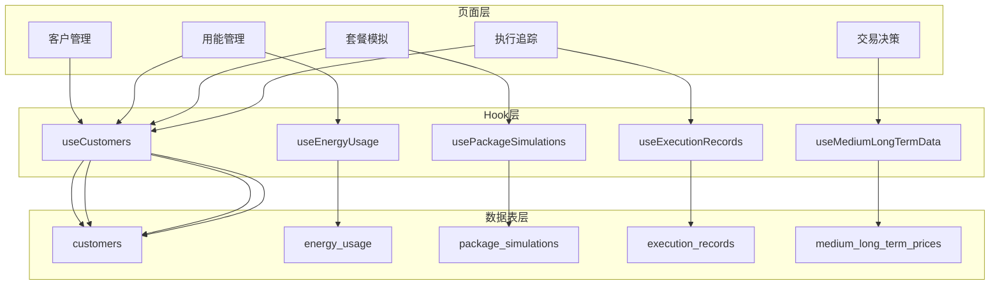
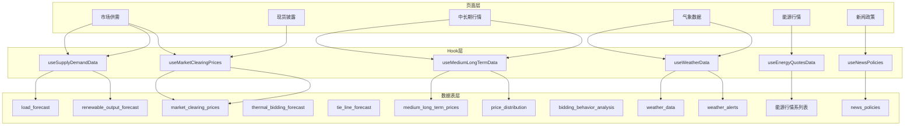

# 页面与数据表对应关系文档

> 本文档详细说明每个页面使用的数据Hooks、数据库表和数据流向。

## 目录

1. [首页大屏](#1-首页大屏)
2. [新能源发电侧](#2-新能源发电侧)
3. [售电业务侧](#3-售电业务侧)
4. [市场与基本面数据](#4-市场与基本面数据)
5. [报表与报告](#5-报表与报告)
6. [系统管理](#6-系统管理)

---

## 1. 首页大屏

### Dashboard (/)

**页面路径**: `src/pages/Dashboard.tsx`

**使用的Hook**: `useDashboardData`

**数据表映射**:

| 页面组件 | 数据字段 | 数据库表 | 字段映射 |
|----------|----------|----------|----------|
| 总装机容量卡片 | totalCapacity | power_stations | SUM(installed_capacity) |
| 场站数量 | stationCount | power_stations | COUNT(*) |
| 结算电量 | settlementVolume | settlement_records | SUM(volume) |
| 结算费用 | settlementAmount | settlement_records | SUM(amount) |
| 区域生产图表 | regionData | power_stations | GROUP BY province |
| 中国地图 | stationLocations | power_stations | location_lat, location_lng |
| 中长期交易明细 | contractData | contracts, settlement_records | 合同执行情况 |
| 省内现货图表 | clearingTrend | clearing_records | 按日期聚合 |
| 供需预测 | priceForecast | market_clearing_prices | 近期价格趋势 |
| 分项结算表 | settlementBreakdown | settlement_records | GROUP BY category |

**数据流向**:
```
Dashboard.tsx
    └── useDashboardData()
        ├── power_stations → 装机容量、地图标记
        ├── trading_units → 交易单元列表
        ├── settlement_records → 结算汇总
        ├── clearing_records → 出清趋势
        └── market_clearing_prices → 价格预测
```

---

## 2. 新能源发电侧

### 2.1 交易日历 (/renewable/calendar)

**页面路径**: `src/pages/renewable/TradingCalendar.tsx` (待创建)

**使用的Hook**: `useTradingCalendar`

| 页面组件 | 数据字段 | 数据库表 |
|----------|----------|----------|
| 日历视图 | calendarEvents | trading_calendar |
| 交易列表 | tradingRecords | trading_calendar |
| 筛选器 | tradingCenters | trading_calendar.trading_center (DISTINCT) |

### 2.2 基础数据 (/renewable/base-data)

**页面路径**: `src/pages/renewable/BaseData.tsx`

#### Tab1: 合同管理

**使用的Hook**: `useContracts`

| 页面组件 | 数据字段 | 数据库表 |
|----------|----------|----------|
| 合同列表 | contracts | contracts |
| 合同详情 | contractDetail | contracts + contract_time_series |
| 交易单元下拉 | tradingUnits | trading_units |

#### Tab2: 发电计划

**使用的Hook**: `usePowerPlanData`, `usePowerPlanTimeSeries`

| 页面组件 | 数据字段 | 数据库表 |
|----------|----------|----------|
| 计划概览 | planSummary | power_plans |
| 年度计划图表 | annualPlan | power_plans (plan_type='annual') |
| 月度计划列表 | monthlyPlans | power_plans (plan_type='monthly') |
| 时序曲线 | timeSeriesData | power_plan_time_series |

### 2.3 交易决策 (/renewable/decision)

**页面路径**: `src/pages/renewable/Decision.tsx`

#### Tab1: AI功率预测

**使用的Hook**: `usePredictionData`

| 页面组件 | 数据字段 | 数据库表 |
|----------|----------|----------|
| 预测指标卡 | accuracyMetrics | load_predictions (计算MAPE) |
| P10/P50/P90曲线 | predictionData | load_predictions |
| 预测vs实际对比 | comparisonData | load_predictions (actual_load) |
| 误差分析表 | errorAnalysis | load_predictions (计算偏差) |

#### Tab2: 策略配置

**使用的Hook**: `useTradingStrategies`

| 页面组件 | 数据字段 | 数据库表 |
|----------|----------|----------|
| 策略模板卡片 | presetStrategies | trading_strategies (is_preset=true) |
| 用户策略列表 | userStrategies | trading_strategies (user_id匹配) |
| 策略编辑表单 | strategyDetail | trading_strategies |

#### Tab3: 回测模拟

**使用的Hook**: `useBacktestResults`

| 页面组件 | 数据字段 | 数据库表 |
|----------|----------|----------|
| 回测指标卡 | performanceMetrics | backtest_results |
| 收益曲线图 | returnCurve | backtest_results.trades_detail |
| 交易明细表 | tradeLog | backtest_results.trades_detail |

#### Tab4: 日滚动交易

**使用的Hook**: `usePredictionData`, `useTradingStrategies`

| 页面组件 | 数据字段 | 数据库表 |
|----------|----------|----------|
| 价格预测 | pricePrediction | price_predictions |
| 策略推荐 | recommendations | strategy_recommendations |

### 2.4 交易操作台 (/renewable/console)

**页面路径**: `src/pages/renewable/Console.tsx`

#### Tab: 省内现货申报

**组件**: `IntraProvincialSpotBidding`

| 页面组件 | 数据字段 | 数据库表 |
|----------|----------|----------|
| 策略指标卡 | settlementPrediction | 计算得出 |
| 出力数据表 | powerData | load_predictions |
| 推荐策略 | recommendations | strategy_recommendations + trading_strategies |

**数据写入**:
- 申报提交 → trading_bids (INSERT)

### 2.5 出清管理 (/renewable/clearing)

**页面路径**: `src/pages/renewable/Clearing.tsx`

**使用的Hook**: `useClearingRecords`, `useTimeSegmentClearing`

| 页面组件 | 数据字段 | 数据库表 |
|----------|----------|----------|
| 日期筛选器 | selectedDate | - |
| 价格曲线图 | priceData | clearing_records |
| 电量柱状图 | volumeData | clearing_records |
| 分时段表格 | segmentData | time_segment_clearing |

### 2.6 结算管理 (/renewable/settlement)

**页面路径**: `src/pages/renewable/Settlement.tsx`

**使用的Hook**: `useSettlementRecords`

| 页面组件 | 数据字段 | 数据库表 |
|----------|----------|----------|
| 筛选器 | filters | - |
| 三级树形表格 | settlementTree | settlement_records (GROUP BY) |
| 汇总统计 | summary | settlement_records (SUM) |

### 2.7 复盘分析 (/renewable/review)

**页面路径**: `src/pages/renewable/Review.tsx`

**使用的Hook**: `useReviewData`

| Tab | 数据字段 | 数据库表 |
|-----|----------|----------|
| 中长期策略复盘 | contractAnalysis | contracts, settlement_records |
| 省内现货复盘 | spotReview | clearing_records, price_predictions |
| 省间现货复盘 | interProvinceReview | clearing_records |

---

## 3. 售电业务侧

### 3.1 交易日历 (/retail/calendar)

与新能源侧共用 `useTradingCalendar`

### 3.2 基础数据 (/retail/base-data)

**页面路径**: `src/pages/retail/BaseData.tsx`

#### Tab1: 发电计划

**使用的Hook**: `usePowerPlanData`

| 页面组件 | 数据字段 | 数据库表 |
|----------|----------|----------|
| 计划概览 | planSummary | power_plans |
| 曲线维护 | timeSeriesData | power_plan_time_series |

#### Tab2: 合同管理

**使用的Hook**: `useContracts`

#### Tab3: 合同分析

**使用的Hook**: `useContracts`

| 页面组件 | 数据字段 | 数据库表 |
|----------|----------|----------|
| 合同统计 | contractStats | contracts (聚合计算) |
| 持仓分析 | positionAnalysis | contracts + contract_time_series |

### 3.3 交易决策 (/retail/decision)

**页面路径**: `src/pages/retail/Decision.tsx`

#### 月内合同交易决策 (MediumLongTerm.tsx)

**使用的Hook**: `useMediumLongTermData`, `useRealtimeData`

| 页面组件 | 数据字段 | 数据库表 |
|----------|----------|----------|
| 时段价格散点图 | priceScatter | medium_long_term_prices |
| 全国行情图表 | nationalMarket | medium_long_term_prices |
| 持仓估值分析 | positionValuation | contracts + medium_long_term_prices |
| 指标卡片 | marketIndicators | medium_long_term_prices (实时) |

**弹窗数据**:
| 弹窗 | 数据字段 | 数据库表 |
|------|----------|----------|
| 行情走势分析 | trendAnalysis | medium_long_term_prices (历史) |
| 实时成交追踪 | realtimeTracking | medium_long_term_prices |
| 历史成交分析 | historicalAnalysis | medium_long_term_prices |

### 3.4 客户管理 (/retail/trading/customer-management)

**页面路径**: `src/pages/retail/trading/CustomerManagement.tsx`

**使用的Hook**: `useCustomers`

| 页面组件 | 数据字段 | 数据库表 |
|----------|----------|----------|
| 客户列表 | customers | customers |
| 统计卡片 | customerStats | customers (聚合) |
| 客户详情 | customerDetail | customers |

**数据写入**:
- 新增客户 → customers (INSERT)
- 编辑客户 → customers (UPDATE)

### 3.5 用能管理 (/retail/trading/load-management)

**页面路径**: `src/pages/retail/trading/LoadManagement.tsx`

**使用的Hook**: `useEnergyUsage`, `useCustomers`

| Tab | 数据字段 | 数据库表 |
|-----|----------|----------|
| 用电概览 | usageOverview | energy_usage |
| 预测偏差分析 | deviationAnalysis | energy_usage (deviation_rate) |
| 盈亏与排名 | profitRanking | energy_usage (profit_loss) |
| 优质客户聚焦 | qualityCustomers | energy_usage + customers |

### 3.6 套餐模拟 (/retail/trading/package-simulation)

**页面路径**: `src/pages/retail/trading/PackageSimulation.tsx`

**使用的Hook**: `usePackageSimulations`, `useCustomers`

| 页面组件 | 数据字段 | 数据库表 |
|----------|----------|----------|
| 客户选择 | customers | customers |
| 模拟方案列表 | simulations | package_simulations |
| 模拟计算器 | calculatorForm | - (前端计算) |
| 历史方案 | savedSchemes | package_simulations |

**数据写入**:
- 保存方案 → package_simulations (INSERT)
- 删除方案 → package_simulations (DELETE)

### 3.7 执行追踪 (/retail/trading/execution-tracking)

**页面路径**: `src/pages/retail/trading/ExecutionTracking.tsx`

**使用的Hook**: `useExecutionRecords`, `useCustomers`

| Tab | 数据字段 | 数据库表 |
|-----|----------|----------|
| 执行概览 | executionOverview | execution_records |
| 客户汇总 | customerSummary | execution_records (GROUP BY customer_id) |
| 异常监控 | anomalyList | execution_records (deviation_rate > 10%) |

### 3.8 出清管理 (/retail/clearing-settlement)

与新能源侧共用 `useClearingRecords`, `useTimeSegmentClearing`

### 3.9 结算管理 (/retail/clearing-settlement)

与新能源侧共用 `useSettlementRecords`

---

## 4. 市场与基本面数据

### 4.1 市场供需 (/market-fundamentals/supply-demand)

**页面路径**: `src/pages/forecast/SupplyDemand.tsx`

**使用的Hook**: `useSupplyDemandData`, `useMarketClearingPrices`

| Tab | 数据字段 | 数据库表 |
|-----|----------|----------|
| 市场行情 | marketQuotes | market_clearing_prices |
| 火电竞价空间 | thermalBidding | thermal_bidding_forecast |
| 发电总出力 | totalOutput | renewable_output_forecast |
| 新能源负荷 | renewableLoad | load_forecast |
| 统调负荷 | gridLoad | load_forecast |
| 外送电计划 | tieLinePlan | tie_line_forecast |

**特殊组件**:
| 组件 | 说明 |
|------|------|
| 竞价空间散点图 | X: bidding_space, Y: day_ahead_price |
| 多日期范围选择器 | 支持多段日期区间查询 |

### 4.2 省内现货披露 (/market-fundamentals/spot-disclosure)

**页面路径**: `src/pages/market-fundamentals/SpotDisclosure.tsx`

**使用的Hook**: `useMarketClearingPrices`

| 页面组件 | 数据字段 | 数据库表 |
|----------|----------|----------|
| 价格曲线 | priceTrend | market_clearing_prices |
| 价格表格 | priceTable | market_clearing_prices |
| 统计卡片 | priceStats | market_clearing_prices (MAX/MIN/AVG) |

### 4.3 中长期行情 (/market-fundamentals/medium-long-term)

**页面路径**: `src/pages/market-fundamentals/MediumLongTerm.tsx`

**使用的Hook**: `useMediumLongTermData`

| Tab | 数据字段 | 数据库表 |
|-----|----------|----------|
| 成交行情 | tradingData | medium_long_term_prices |
| 价格分布 | priceDistribution | price_distribution |
| 竞价行为 | biddingBehavior | bidding_behavior_analysis |

### 4.4 气象数据 (/market-fundamentals/weather)

**页面路径**: `src/pages/market-fundamentals/WeatherData.tsx`

**使用的Hook**: `useWeatherData`

| Tab | 数据字段 | 数据库表 |
|-----|----------|----------|
| 气象地图 | mapData | weather_data |
| 气象对比 | comparisonData | weather_data |
| 预警信息 | alerts | weather_alerts |

### 4.5 能源行情 (/market-fundamentals/energy)

**页面路径**: `src/pages/market-fundamentals/EnergyQuotes.tsx`

**使用的Hook**: `useEnergyQuotesData`

| 页面区域 | 数据字段 | 数据库表 |
|----------|----------|----------|
| 国际原油 | crudeQuotes | energy_crude_quotes |
| 成品油 | refinedQuotes | energy_refined_quotes |
| 裂解价差 | crackSpreads | energy_crack_spreads |
| 库存数据 | inventory | energy_inventory |
| 相关股票 | stocks | energy_related_stocks |
| 新闻滚动 | news | energy_news |
| 市场指数 | indices | energy_market_indices |
| INE日内 | ineIntraday | energy_ine_intraday |

### 4.6 新闻政策 (/market-fundamentals/news-policy)

**页面路径**: `src/pages/market-fundamentals/NewsPolicy.tsx`

**使用的Hook**: `useNewsPolicies`

| 页面组件 | 数据字段 | 数据库表 |
|----------|----------|----------|
| 新闻列表 | newsList | news_policies |
| 分类筛选 | categories | news_policies.category (DISTINCT) |
| 详情弹窗 | newsDetail | news_policies |

### 4.7 机组结算 (/market-fundamentals/unit-settlement)

**页面路径**: `src/pages/market-fundamentals/UnitSettlement.tsx`

**使用的Hook**: `useSettlementRecords`

| 页面组件 | 数据字段 | 数据库表 |
|----------|----------|----------|
| 结算汇总 | summaryData | settlement_records + trading_units |
| 分类明细 | categoryBreakdown | settlement_records (GROUP BY) |

---

## 5. 报表与报告

### 5.1 报表管理 (/reports/management)

**页面路径**: `src/pages/reports/ReportManagement.tsx`

**数据源**:
- 直接使用 Supabase Client 查询多表

| 页面组件 | 数据字段 | 数据库表 |
|----------|----------|----------|
| 模板列表 | templates | report_templates |
| 数据源选择 | dataSources | 多表 |
| 透视表渲染 | pivotData | 动态查询 |

**支持的数据源**:
| 数据源ID | 名称 | 对应表 |
|----------|------|--------|
| settlement_data | 结算数据 | settlement_records |
| clearing_data | 出清数据 | clearing_records |
| contract_data | 合同数据 | contracts |
| market_prices | 市场价格 | market_clearing_prices |

### 5.2 报告分析 (/reports/analysis)

**页面路径**: `src/pages/reports/ReportAnalysis.tsx` (待开发)

**使用的Hook**: `useAnalysisReports`

| 页面组件 | 数据字段 | 数据库表 |
|----------|----------|----------|
| 报告列表 | reports | analysis_reports |
| 报告详情 | reportContent | analysis_reports |

---

## 6. 系统管理

### 6.1 系统管理 (/system)

**页面路径**: `src/pages/SystemManagement.tsx`

| Tab | 数据字段 | 数据库表 |
|-----|----------|----------|
| 用户管理 | users | profiles + user_roles |
| 权限配置 | permissions | permissions |
| 业务范围 | businessScope | user_business_scope |

---

## 附录: 数据流架构图

### A. 新能源发电侧数据流

```mermaid
flowchart TD
    subgraph Pages["页面层"]
        Calendar[交易日历]
        BaseData[基础数据]
        Decision[交易决策]
        Console[交易操作台]
        Clearing[出清管理]
        Settlement[结算管理]
        Review[复盘分析]
    end
    
    subgraph Hooks["Hook层"]
        useTradingCalendar
        useContracts
        usePowerPlanData
        usePredictionData
        useTradingStrategies
        useBacktestResults
        useClearingRecords
        useTimeSegmentClearing
        useSettlementRecords
        useReviewData
    end
    
    subgraph Tables["数据表层"]
        trading_calendar
        contracts
        contract_time_series
        power_plans
        power_plan_time_series
        trading_units
        load_predictions
        price_predictions
        trading_strategies
        backtest_results
        strategy_recommendations
        trading_bids
        clearing_records
        time_segment_clearing
        settlement_records
    end
    
    Calendar --> useTradingCalendar --> trading_calendar
    BaseData --> useContracts --> contracts
    BaseData --> useContracts --> contract_time_series
    BaseData --> usePowerPlanData --> power_plans
    BaseData --> usePowerPlanData --> power_plan_time_series
    Decision --> usePredictionData --> load_predictions
    Decision --> usePredictionData --> price_predictions
    Decision --> useTradingStrategies --> trading_strategies
    Decision --> useBacktestResults --> backtest_results
    Console --> usePredictionData --> load_predictions
    Console --> useTradingStrategies --> trading_strategies
    Clearing --> useClearingRecords --> clearing_records
    Clearing --> useTimeSegmentClearing --> time_segment_clearing
    Settlement --> useSettlementRecords --> settlement_records
    Review --> useReviewData --> contracts
    Review --> useReviewData --> clearing_records
    Review --> useReviewData --> settlement_records
```



### B. 售电业务侧数据流



### C. 市场数据流


